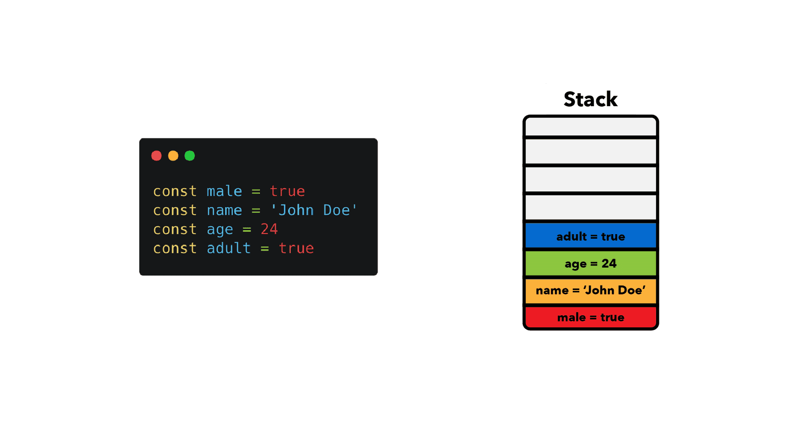

# Javascript Memory management

Unlike low-level languages like C, JavaScript automatically allocates memory when objects are created and frees it when 
not in use anymore (garbage collection). C has memory-management techniques like malloc() and free(). It doesn’t mean 
that we don’t need to worry about memory management in JavaScript.

## Memory lifecycle
Irrespective of the programming language, the memory life cycle follows the following stages:

1. Allocates the memory we need: JavaScript allocates memory to the object created.
2. Use the allocated memory.
3. Release the memory when not in use: Once the allocated memory is released, it is used for other purposes.
It is handled by a JavaScript engine.

## Allocating 
Javascript has two places to store data, the `stack` and the `heap`.

### Stack 
A stack is a data structure that JavaScript uses to store static data. Static data is data where the engine knows the
size at compile time. In JavaScript, this includes `primitive values` (strings, numbers, booleans, undefined, and null) 
and `references`, which point to objects and functions. Since the engine knows that the size won't change, it will allocate
a `fixed amount of memory` for each value. The process of allocating memory right before execution is known as `static 
memory allocation`. Because the engine allocates a fixed amount of memory for these values, there is a limit to how large 
primitive values can be.



### Heap
The heap is a different space for storing data where JavaScript stores objects and functions. Unlike the stack, 
the engine doesn't allocate a fixed amount of memory for these objects. Instead, more space will be allocated as needed. 
Allocating memory this way is also called dynamic memory allocation.


```javascript
const n = 123; // allocates memory for a number
const s = "azerty"; // allocates memory for a string

const o = {
  a: 1,
  b: null,
}; // allocates memory for an object and contained values

// (like object) allocates memory for the array and
// contained values
const a = [1, null, "abra"];

function f(a) {
  return a + 2;
} // allocates a function (which is a callable object)

// function expressions also allocate an object
someElement.addEventListener(
  "click",
  () => {
    someElement.style.backgroundColor = "blue";
  },
  false,
);
```

| Stack                               | Heap                       |
|-------------------------------------|----------------------------|
| Primitive data types and references | Objects and functions      |
| Size is known at compile time       | Size is known at run time  |
| Fixed memory allocated              | No limit for object memory |


## Using the allocated memory
Using values basically means reading and writing in allocated memory. This can be done by reading or writing the value
of a variable or an object property or even passing an argument to a function.

## Releasing memory
Low-level languages require the developer to manually determine at which point in the program the allocated memory is no 
longer needed and to release it. Some high-level languages, such as JavaScript, utilize a form of automatic memory 
management known as `Garbage collection`.
Once the JavaScript engine recognizes that a given variable or function is not needed anymore, it releases the memory it occupied.
The main issue with this is that whether or not some memory is still needed is an undecidable problem, which means that
there can't be an algorithm that's able to collect all the memory that's not needed anymore in the exact moment it becomes obsolete.
Some algorithms help to find the moment when they become obsolete with great precision.

In JavaScript, the garbage collector operates automatically without requiring explicit actions from developers. It is 
built into the JavaScript runtime environment and handles the memory management process behind the scenes.

### Reference-counting garbage collection
This one is the easiest approximation. It collects the objects that have no references pointing to them.
The problem with this algorithm is that it doesn't consider cyclic references. This happens when one or more objects 
reference each other, but they can't be accessed through code anymore.

```javascript
let son = {
  name: 'John',
};

let dad = {
  name: 'Johnson',
}

son.dad = dad;
dad.son = son;

son = null;
dad = null;
```

|                                                                                                          |
|------------------------------------------------------------------------------------------------------------------------------------------------------------------|
| Because `son` and `dad` objects reference each other, the algorithm won't release the allocated memory. There's no way for us to access the two objects anymore. |

### Mark-and-sweep algorithm
The mark-and-sweep algorithm has a solution to cyclic dependencies. Instead of simply counting the references to a 
given object, it detects if they are `reachable from the root object`.


The algorithm marks the objects that aren't reachable as garbage, and sweeps (collects) them afterward. Root objects will
never be collected. This way, cyclic dependencies are not a problem anymore. In the example from before, neither the `dad`
nor the `son` object can be reached from the root. Thus, both of them will be marked as garbage and collected. 

Since 2012, this algorithm is implemented in all modern browsers. Improvements have only been made to performance and 
implementation, but not to the algorithm's core idea itself.


*Automatic garbage collection allows us to focus on building applications instead of losing time with memory management. 
However, there are some tradeoffs that we need to be aware of.*

***

## Memory leaks
memory leaks can be defined as memory that is not required by an application anymore that for some reason is not returned 
to the operating system or the pool of free memory. The two garbage collectors mentioned above haven't picked them out
to delete. 

There are three types of common JavaScript leaks.

### Accidental global variables
One of the objectives behind JavaScript was to develop a language that looked like Java but was permissive enough to be 
used by beginners. One of the ways in which JavaScript is permissive is in the way it handles undeclared variables: a 
reference to an undeclared variable creates a new variable inside the global object. In the case of browsers, the global 
object is `window`.

```javascript
function foo(arg) {
    // These methods will create a global variable, which creates a memory leak.
    bar = "this is a hidden global variable"; 
    this.variable = "potential accidental global";
}

function foo(arg) {
    // This is the correct way of creating a variable to use inside the scope of the 'foo' function.
    let bar = "this is variable inside the 'foo' scope"; 
}
```

### DOM leaks
Manipulating the DOM is a common task in JavaScript. However, if you add event listeners or create references to DOM 
elements and fail to remove or release them properly, they can lead to memory leaks. For instance, adding event listeners
without removing them when elements are removed from the DOM can keep those elements and associated memory alive 
unnecessarily. To prevent DOM leaks, make sure to remove event listeners, clear references to DOM elements, and clean 
up any related data when elements are n o longer needed.


In this example, an event listener is added to the button element. But if the button is removed, that event listener
still exists in memory.

```javascript
// Wrong way: Adding event listeners without removing them

function setup() {
  var button = document.getElementById('myButton');
  button.addEventListener('click', handleClick);
}

function handleClick() {
  // Do something
}

// Later, if the button is removed from the DOM
button.parentNode.removeChild(button);
```

In this example the event listener is deleted when the element is deleted.
```javascript
// Right way: Adding and removing event listeners properly

function setup() {
  var button = document.getElementById('myButton');
  button.addEventListener('click', handleClick);
}

function handleClick() {
  // Do something
}

// Later, if the button is removed from the DOM
button.removeEventListener('click', handleClick);
button.parentNode.removeChild(button);
```

### Closure leaks
Closures in JavaScript allow inner functions to access variables from their outer scopes. However, if an inner function 
maintains a reference to an outer variable that is no longer needed, it can prevent the garbage collector from reclaiming 
the memory associated with that variable. This is known as a closure leak. To avoid this, ensure that functions and 
closures release any unnecessary references once they are no longer required. For example, remove event listeners or 
nullify references to external objects within closures when they are no longer needed.


## sources
[geeksforgeeks](https://www.geeksforgeeks.org/memory-management-in-javascript/)<br>
[mozilla](https://developer.mozilla.org/en-US/docs/Web/JavaScript/Memory_management)<br>
[felixgerschau](https://felixgerschau.com/javascript-memory-management/#stack-static-memory-allocation)<br>
[auth0](https://auth0.com/blog/four-types-of-leaks-in-your-javascript-code-and-how-to-get-rid-of-them/)